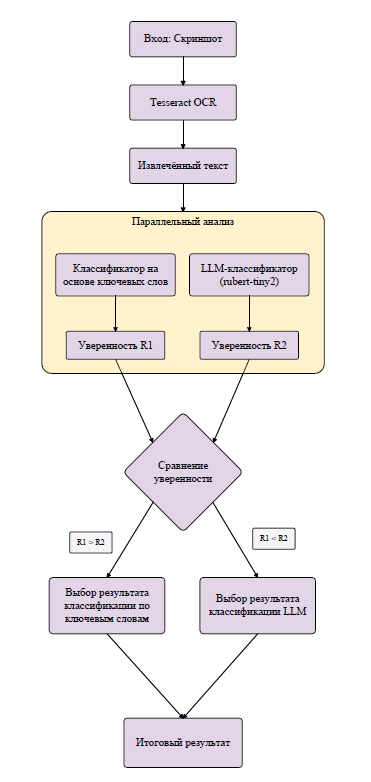

# Разработка модели классификации экранной активности

## Описание модели:

Используется *Tesseract OCR* для распознования текста с изображений (скриншотов),

*LLM* + *ключевые слова* для классификации полученного текста по 4 видам экранной активности:

* рабочая активность;
* нерабочая активность;
* вредоносные сайты;
* нейтральная / системная активность.
  
В качестве LLM модели используется предобученная модель [rubert-tiny2](https://huggingface.co/cointegrated/rubert-tiny2), в качестве данных для модели rubert-tiny2 был выбран датасет
[website-screenshots](https://www.kaggle.com/datasets/pooriamst/website-screenshots)



## Структура репозитория:
```
ai-screen-activity-classification/
├── server/
│   ├── models/
│   │   ├── llm/
│   │   │   ├── __init__.py
│   │   │   ├── dataset/
│   │   │   │   ├── raw_dataset.json
│   │   │   │   ├── train.json
│   │   │   │   ├── val.json
│   │   │   │   ├── label_map.json
│   │   │   │   └── test.jsonl
│   │   │   ├── trained_model/
│   │   │   │   ├── config.json
│   │   │   │   ├── mettrics.json     
│   │   │   │   ├── pytorch_model.bin
│   │   │   │   ├── special_tokens_map.json
│   │   │   │   ├── tokenizer.json
│   │   │   │   ├── tokenizer_config.json
│   │   │   │   └── vocab.txt
│   │   │   └── transformer_classifer.py
│   │   ├── __init__.py 
│   │   ├── activity_classifier.py
│   │   ├── hybrid_classifier.py
│   │   ├── install_tesseract.py
│   │   ├── keyword_lists.py
│   │   ├── ocr_processor.py
│   │   ├── README.md
│   │   └── requirements.txt
│   ├── vendor/
│   │   ├── tesseract
│   │   │   ├── linux/
│   │   └   └── windows/ 
└── README.md
```

## Установка и подготовка модели к использованию

### 1. Клонирование репозитория *mikhailpisemsky/ai-screen-activity-classification*

```bash
git clone https://github.com/mikhailpisemsky/ai-screen-activity-classification.git
```

```bash
cd ai-screen-activity-classification
```

```bash
git lfs fetch --all
```

### 2. Создание виртуального окружения

1.) Установка виртуального окружения

```bash
cd server
```

```bash
python -m venv virtualenv
```

2.) Активация виртуального окружения

```bash
virtualenv\Scripts\activate
```

### 3. Установка Tesseract OCR в vendor каталог

**Вариант 1: Автоматическая установка**

```bash
cd models
```

```bash
python install_tesseract.py
```

**Вариант 2: Ручная установка для Windows**

*1.) Скачайте установщик Tesseract:*

* https://github.com/UB-Mannheim/tesseract/wiki

* Или: https://digi.bib.uni-mannheim.de/tesseract/tesseract-ocr-w64-setup-5.3.1.20230401.exe

*2.) Установите в каталог:*

```bash
server/vendor/tesseract/windows/
```

*3.) Выберите языки:*

* Английский

* Русский

1.) На шаге установки Choose Components найдите подраздел Additional language data;

2.) Включите галочки напротив "Russian" и "English"

**Вариант 3: Ручная установка для Linux**

```bash
sudo apt-get update
```

```bash
sudo apt-get install -y tesseract-ocr tesseract-ocr-rus tesseract-ocr-eng
```

```bash
cd server/models
```

```bash
python install_tesseract.py --verify-only
```

### 4. Установка зависимостей Python
```bash
cd models
```

```bash
pip install -r requirements.txt
```

### 5. Пример использования модели в коде
```python
import sys
from pathlib import Path

sys.path.insert(0, str(Path(__file__).parent / 'models'))

from models.ocr_processor import OCRProcessor
from models.hybrid_classifier import HybridActivityClassifier

# Инициализация
ocr = OCRProcessor()
classifier = HybridActivityClassifier()

# Классификация изображения
result = classifier.classify_image("screenshot.png", ocr)

print(f"Категория: {result.category.value}")
print(f"Подкатегория: {result.subcategory}")
print(f"Уверенность: {result.confidence:.2%}")
```

### Настройка ключевых слов (опционально, под свои требования)

Ключевые слова хранятся в keyword_lists.py. Для редактирования:

1. Откройте keyword_lists.py

2. Добавьте ключевые слова в соответствующие категории

3. Перезапустите классификатор
